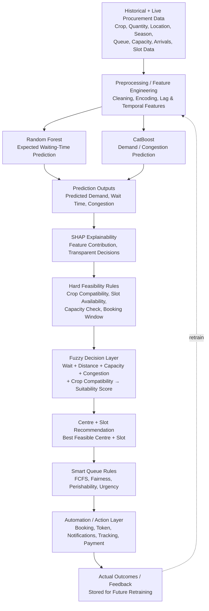
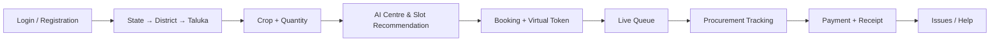
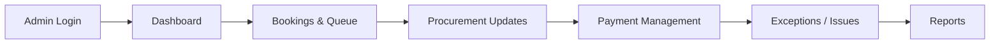

# AGRI-NEX

**Smart Procurement Slot & Queue Management System — prove it works before farmers wait for it.**

AGRI-NEX is an AI-driven queue and slot allocation platform for government procurement centres (APMC mandis / MSP procurement). It replaces manual, first-come-first-served queuing with predictive slot recommendation, live queue tracking, and procurement/payment status visibility — for both farmers and procurement authorities.

> Note - **AGRI-NEX does not process or integrate with government payment/DBT systems.** The Payment Management module tracks and displays payment *status* (Pending / Processing / Completed / Failed), manually updated by the procurement authority once payment is settled through existing government channels. Direct integration with an official disbursement/DBT API is intentionally out of scope — AGRI-NEX is a queue and slot management layer, not a payments system.

Built for **Smart India Hackathon 2026**, Problem Statement **SIH26032** (Ministry of Consumer Affairs, Food & Public Distribution — Department of Consumer Affairs).

---

## Table of Contents
- [Problem](#problem)
- [Architecture](#architecture)
- [Farmer Portal Flow](#farmer-portal-flow)
- [Admin Portal Flow](#admin-portal-flow)
- [Repository Structure](#repository-structure)
- [Tech Stack](#tech-stack)
- [Getting Started](#getting-started)
- [Portal & Module Coverage](#portal--module-coverage)
- [Current Scope & Known Limitations](#current-scope--known-limitations)
- [Roadmap](#roadmap)
- [Data & Grounding](#data--grounding)
- [Deliverables](#deliverables)

---

## Problem

Farmers at government procurement centres face long, unpredictable waiting times, no visibility into procurement schedules, and no way to track procurement or payment status once they arrive. AGRI-NEX replaces this with slot booking, live queue visibility, and predictive wait-time estimation — for both the farmer and the procurement authority.

---

## Architecture

AGRI-NEX runs every booking request through a layered decision pipeline, moving from raw procurement data to an explainable, feasible slot recommendation.



**Why layered like this, specifically:** the hard feasibility rules are a deterministic safety net — a booking can never be confirmed against a full or closed centre, even if the ML prediction layer is wrong or unavailable. The ML layer (Random Forest + CatBoost) adds *predictive* intelligence — expected wait, expected congestion — on top of that guarantee, and SHAP keeps every recommendation auditable rather than a black box, which matters because this is a government-facing system.

| Stage | Component | What it does |
|---|---|---|
| 1 | Data Layer | Pulls crop, quantity, location, season, queue length, capacity, arrival rate, and slot data in real time |
| 2 | Preprocessing | Cleans and encodes data; builds lag and temporal features |
| 3 | Random Forest | Regression model predicting expected waiting time per centre/slot |
| 4 | CatBoost | Predicts demand/arrival volume and congestion at a centre |
| 5 | SHAP | Attaches feature-contribution scores to every prediction |
| 6 | Hard Feasibility Rules | Deterministic pass/fail checks — runs regardless of ML output |
| 7 | Fuzzy Decision Layer | Combines all signals into one centre/slot suitability score |
| 8 | Smart Queue Rules | Orders the queue by FCFS, fairness, crop perishability, urgency |
| 9 | Automation Layer | Issues booking, token, notifications, tracks status |
| 10 | Feedback Loop | Logs real outcomes for future model retraining |

---

## Farmer Portal Flow



| Step | Screen | Purpose |
|---|---|---|
| 1 | Login / Registration | Farmer onboarding |
| 2 | State → District → Taluka | Location selection |
| 3 | Crop + Quantity | Procurement request details |
| 4 | AI Centre & Slot Recommendation | Fuzzy-ranked best feasible centre/slot shown to farmer |
| 5 | Booking + Virtual Token | Slot confirmed, token issued |
| 6 | Live Queue | Real-time queue position and ETA |
| 7 | Procurement Tracking | Status updates as authority processes the booking |
| 8 | Payment + Receipt | Payment status (Pending/Processing/Completed/Failed) + receipt |
| 9 | Issues / Help | Exception reporting |

---

## Admin Portal Flow



| Step | Screen | Purpose |
|---|---|---|
| 1 | Admin Login | Role-based access via Firebase Auth |
| 2 | Dashboard | Centre-level overview: live queue, capacity, bookings |
| 3 | Bookings & Queue | Manage incoming bookings and queue order |
| 4 | Procurement Updates | Update procurement status per farmer |
| 5 | Payment Management | Update payment status |
| 6 | Exceptions / Issues | Handle no-shows, disputes, manual overrides |
| 7 | Reports | Centre-level and district-level reporting |

**Key frontend design decisions:**
- **Offline-first PWA** — cached data so farmers in low-connectivity areas can still view bookings/queue status
- **SMS/IVR fallback** — for farmers without a smartphone or reliable data
- **Multilingual by default** — English, Hindi, Marathi
- **No app installation required** — installable PWA, not a native app requiring a separate build per platform

> Frontend source code is maintained separately and is not included in this repository. The flows above document its structure and behavior for reference.

---

## Repository Structure

```
agri-nex/
├── backend/
│   ├── ai_engine/
│   │   ├── preprocessing.py            # Feature engineering: lag, temporal, encoding
│   │   ├── waiting_time_model.py       # Random Forest regression
│   │   ├── demand_congestion_model.py  # CatBoost regression/classification
│   │   ├── shap_explainer.py           # SHAP feature attribution
│   │   ├── feasibility_rules.py        # Hard rule-based filtering (deterministic)
│   │   └── fuzzy_decision.py           # Fuzzy suitability scoring, centre/slot ranking
│   ├── api/
│   │   ├── farmer_routes.py            # Registration, booking, tracking endpoints
│   │   ├── authority_routes.py         # Dashboard, queue, procurement, payment endpoints
│   │   └── notification_routes.py      # SMS / push / IVR triggers
│   ├── db/
│   │   ├── models.py                   # FARMER, PROCUREMENT_CENTRE, SLOT, BOOKING, PROCUREMENT, PAYMENT, NOTIFICATION
│   │   └── migrations/
│   ├── auth/                           # Firebase Authentication, role-based access
│   ├── main.py                         # FastAPI app entrypoint
│   ├── requirements.txt
│   └── env.example
├── docs/
│   └── dataset-sources.md
├── README.md
└── LICENSE
```

*(Update this to match your actual backend folder names before committing.)*

---

## Tech Stack

| Layer | Technology |
|---|---|
| Frontend | React, Vite, Tailwind CSS, PWA |
| Backend / API | Python, FastAPI, REST APIs |
| Prediction models | Random Forest (wait-time regression), CatBoost (demand/congestion) |
| Explainability | SHAP |
| Decision logic | Hard feasibility rules + Fuzzy decision layer |
| Database | PostgreSQL, Supabase |
| Authentication | Firebase Authentication, role-based access |
| Notifications & storage | Supabase Storage, SMS/Push notifications, IVR (voice-ready) |

---

## Getting Started

### Prerequisites
- Python 3.10+
- PostgreSQL (or a Supabase project)
- Firebase project (for Authentication)

### Backend Setup
```bash
cd backend
python -m venv venv
source venv/bin/activate       # Windows: venv\Scripts\activate
pip install -r requirements.txt
cp env.example .env            # fill in DB, Firebase, and SMS/IVR provider credentials
uvicorn main:app --reload
```

The API comes up at `http://127.0.0.1:8000`, with interactive Swagger docs at `http://127.0.0.1:8000/docs`.

| Variable | Required? | Purpose |
|---|---|---|
| `DATABASE_URL` | Yes | PostgreSQL/Supabase connection string |
| `FIREBASE_CONFIG` | Yes | Firebase Authentication credentials |
| `SMS_PROVIDER_API_KEY` | Optional | Enables SMS notifications; falls back to app-only notifications if unset |
| `USE_LIVE_PREDICTIONS` | No (defaults `false`) | `false` = uses last-trained model artifacts; `true` = triggers live model inference |

### Frontend
Frontend source is maintained in a separate, private repository/branch. See [Farmer Portal Flow](#farmer-portal-flow) and [Admin Portal Flow](#admin-portal-flow) above for its full documented structure.

---

## Portal & Module Coverage

| Module | Status |
|---|---|
| Farmer registration & booking | ✅ Demo ready |
| AI centre/slot recommendation (Random Forest + CatBoost + Fuzzy layer) | ✅ Demo ready |
| SHAP explainability on recommendations | ✅ Demo ready |
| Live queue tracking | ✅ Demo ready |
| Admin dashboard & queue management | ✅ Demo ready |
| Payment status tracking | ✅ Demo ready (status only — no government payment/DBT integration, by design) |
| SMS notifications | ⚙️ Integrated, provider-dependent |
| IVR / voice notifications | 🔜 Voice-ready, not wired to a live IVR provider yet |
| Regional languages beyond Hindi/Marathi | 🔜 Roadmap |

---

## Current Scope & Known Limitations

Stated plainly, for the team and for judges:

- **Payment status only, by design** — AGRI-NEX tracks and displays payment status as updated by the procurement authority. Integrating with an official government disbursement/DBT API is out of scope for this system; that responsibility stays with existing government payment infrastructure.
- **Single-region model training** — the current Random Forest/CatBoost models are trained on the pilot dataset described below; performance on unseen districts/crops will need validation before wider rollout.
- **No live IVR integration** — the notification layer is architected to be voice/IVR-ready, but a live IVR provider is not connected in this build.
- **Frontend not included in this repository** — see [Farmer Portal Flow](#farmer-portal-flow) and [Admin Portal Flow](#admin-portal-flow) for full documentation of its structure and behavior.

---

## Roadmap

- Live IVR provider integration for feature-phone farmers
- Regional language expansion beyond Hindi/Marathi
- Multi-district model retraining and validation pipeline
- Pilot → District → Multiple Centres → State phased rollout

---

## Data & Grounding

Models and design decisions are grounded in:

**Academic foundation**
- Design of a Robust Active Queue Management Algorithm Based on Machine Learning
- Offline-First Progressive Web Apps Architecture
- Optimization of Supply Chains and Marketing in Agricultural Networks

**Government integration references**
- Operational Guidelines of Price Stabilization Fund (PSF) Scheme — DoCA
- e-Samridhi Portal Architecture — NAFED
- Central Foodgrains Procurement Portal (CFPP) integration

**Ground reality validation**
- Reporting on farmers waiting in extreme conditions for wheat procurement
- Reporting on procurement delays creating space shortages in mandis

*(List actual dataset names/sources you trained the Random Forest and CatBoost models on here, with links if public.)*

---

## Deliverables

- Live Demo: _link_
- Video Pitch: _link_
- Presentation: _link_

---

Built for Smart India Hackathon 2026 — Problem Statement SIH26032.
